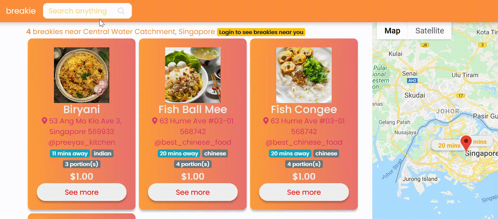

<h1> breakie - made with love, from next door</h1>

[breakie](http://breakie.herokuapp.com/) is a web based application that builds communities through sharing breakfasts.

- [What is breakie?](#what-is-breakie)
- [Who should use breakie?](#who-should-use-breakie)
- [How does it work?](#how-does-it-work)
  * [Who can do what?](#who-can-do-what)
  * [Order life cycle](#order-life-cycle)
- [Mock-ups](#mock-ups)
- [Technologies used](#technologies-used)
  * [Front-end](#front-end)
  * [Backend](#backend)
    + [socket.io](#socketio)
    + [APIs](#apis)
      - [Google Maps](#google-maps)
      - [Stripe Checkout](#stripe-checkout)
      - [Algolia](#algolia)
- [References](#references)

# What is breakie?
The new generation of workers rarely eat breakfast, especially during the rush hours. On the other hand, many cooking enthusiasts often make too much breakfast and can't finish it alone. What if there was a way to close this gap? breakie hopes to solve this issue by providing a platform for busy bees and cook enthusiast to communicate and share. 

# Who should use breakie? 
| Busy bees     | Cooking enthusiasts |
| ----------- | ----------- |
| Convenient  | Meaningful |
| Delicious   | Minimal wastage |
| Cheap       | Earn ingredient cost |
| Know your neighbours | Know your neighbours  |

# How does it work?
- Buyers can visit the site to see what's cooking near them, they are interested, they can purchase it with a minimal fee. 
- Cooking enthusiasts can visit the site to share what they're cooking for the day.

## Who can do what?
| Registered     | Non-registered |
| ----------- | ----------- |
| View breakies  | View breakies |
| Search breakies   | Search breakies |
| View published users       | View published users |
|  Create breakies  |  |
|  Edit breakies |   |
|  Delete breakies |   |
| Place orders |   |
|  Cancel orders |   |
|  Chat to resolve problems |   |

## Order life cycle

| Tag     | Description | Initiated by |
| ----------- | ----------- | -------|
| Completed  | The standard completion of life cycle. This can be initiated by either the buyer or cook enthusiast. | Buyer and cook enthusiast |
| Cancelled  | Should the buyer be unable to pick up the order, the buyer can cancel the order. This leads to completion of the life cycle as well. This can only be initiated by the buyer. | Buyer |
| Unlisted       | Should the cook enthusiast unlist any of the items while an order is still open, the order will be labelled as unlisted. Unlisting a breakie will not affect past orders. However, a chat is required to close the life cycle. | Cook enthusiast |

# Mock-ups

See <a href="https://www.figma.com/file/v3kEtgMjBub29EzJlEfG8N/combined" target="_blank">here</a> for more mockups.

# Technologies used
## Front-end
HTML, CSS, Javascript

## Backend
Node.js, Express.js, Multer, MongoDB, mongoose

### socket.io
For resolving purchase conflicts between busy bees and cook enthusiasts.

### APIs
#### Google Maps
Used for geocoding, distance matrix, map visualisation.

Breakies are displayed in increasing travel time from user's address. When hovered, the map markers highlights the associated breakies. When clicked, a window appears with the breakies of that cook enthusiast. This can be helpful for buyers who might be more interested in travel time than dishes.

#### Stripe Checkout
Used for payment.

#### Algolia

Used for real-time autocomplete and database search. 

This allows searching by breakies' name, description, ingredients, cuisine type, cook enthusiast's username, address. Autocompletion also allows for typos and partial words. This can be helpful for potential buyers as there is a single source of entry and little confusion.

# References
- [GridFS File Upload](https://github.com/ganeshpatro321/fileU)
- [Stripe Checkout](https://stripe.com/docs/payments/checkout)
- [Google Maps](https://developers.google.com/maps/documentation)
- [Algolia](https://www.algolia.com/doc/guides/building-search-ui/resources/ui-and-ux-patterns/in-depth/autocomplete/js/)
- [socket.io](https://socket.io/)